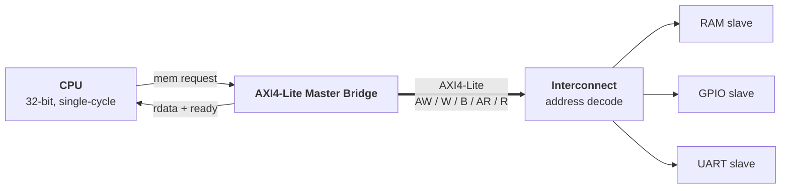

# AXI4-Lite Interconnect for a Custom FPGA SoC

A 32-bit single-cycle CPU with a custom ISA, originally built with a hard-coded memory-mapped
I/O bus. This project replaces that bus with an AXI4-Lite master, interconnect, and slaves so
peripherals plug in through a standard protocol instead of hand-edited decode logic.

## Status

| Piece | State |
|---|---|
| Custom ISA, CPU, assembler, MMIO bus (RAM, GPIO, UART) | Done. Simulated in Icarus Verilog; GPIO output verified on a Tang Nano 9K with an oscilloscope |
| AXI4-Lite master bridge, interconnect, slaves | In progress (simulation, Vivado) |
| Basys 3 bring-up | Planned |

## Before: custom MMIO bus

The CPU exposes a simple memory interface with no handshake. It assumes every access completes
in a fixed number of cycles, and `soc_top` routes requests with a flat address decoder and a
hand-written read mux.

```verilog
// CPU <-> bus: no ready/valid, response assumed next cycle
output [31:0] o_mem_addr, o_mem_write_data,
output        o_mem_read, o_mem_write,
input  [31:0] i_mem_read_data

// soc_top: decoder + read mux
wire led_sel = (mem_addr == LED_ADDR);
...
assign mem_read_data = ram_sel ? ram_read_data :
                       led_sel ? led_out : ... ;
```

Limitations:

- **No handshake.** The registered-BRAM redesign needed a load stall bolted into the CPU, and that stall is uniform, so even GPIO and UART status reads pay a cycle they don't need.
- **Manual wiring per peripheral.** Each new peripheral means another select wire and another branch in the read mux.
- **Silent bad accesses.** An unmapped address reads back as zero with no error.
- **Custom protocol.** Off-the-shelf IP can't plug in without an adapter.

## After: AXI4-Lite

The CPU stays protocol-agnostic. A bridge translates its simple memory requests into AXI4-Lite
transactions, and the CPU waits on a ready signal until the transaction completes.



- **CPU:** ISA and datapath are unchanged. It gains a ready input, so a load or store holds until the bridge reports completion. This replaces the fixed one-cycle load stall with variable-latency waits.
- **Master bridge:** turns each memory request into write (AW/W/B) or read (AR/R) channel transactions using VALID/READY handshakes.
- **Interconnect:** routes each transaction to a slave by address.
- **Slaves:** RAM, GPIO, and UART exposed as AXI4-Lite register interfaces.

## Why Basys 3

- **Vivado's AXI tooling.** Vivado ships AXI IP and verification tooling, which gives me reference behavior to check my own master and slaves against.
- **More room.** The Artix-7 on the Basys 3 is larger than the Tang Nano 9K, where the SoC already used about 44% of the LUTs.
- **Built-in I/O.** Onboard switches, buttons, LEDs, and a USB-UART bridge make GPIO input and UART testing straightforward without extra wiring.

## Roadmap

1. AXI4-Lite master bridge and slave, verified in simulation
2. Interconnect with address decode and error responses for unmapped addresses
3. Basys 3 bring-up in Vivado